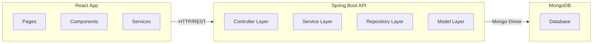

# 🚀 Order Management System

### Author
👩🏻‍💻 Ambar Martell
LinkedIn: [ambar-martell](https://www.linkedin.com/in/ambar-martell)
#
This web system is a solution for managing and viewing orders and its asociated user, it is mainly built with React, typescript, Spring boot, java, and MongoDB.
This solution includes: 
- Web interface with React/Tailwind
- REST API build with Spring Boot/Java
- MongoDB database

## 🛠️ Tech Stack
This project was built with a really well thought, modern and efficient stack, aiming for performance, maintainability, and clean architecture. 

### Backend stack
- Java 21/Spring Boot: Core framework for the REST API and server-side logic.
- Lombok: Used to improve readibility and maitaining consistency through all the code.
- Mongo DB/ Mongo DB Compass: For a seamless interaction with a NoSQL database.
- Maven: Used for dependency management and build automation tool.

### Frontend stack
- React (Vite): Core library for building a high-performance user interface.
- Tailwind CSS: CSS framework for a consistent design.
- React Router: Library for navigation management and routing within the Single Page Application.
- Zustand: Global state management solution, chosen for its simplicity and minimal boilerplate compared to Redux.

## 💡 Reasons for some of these choices:
- Lombok: It allowed me to focus on business logic rather than boilerplate. It also implied a  on getting to understand how an Spring boot/Java API is structured and build.
- Zustand: Chosen as the global state management solution for its minimalist API and low performance overhead. Although the current system is scoped as a small-scale application, it was implemented to ensure future scalability, allowing for easy integration of new features and more complex state transitions as the project grows.

## 👷🏼‍♀️Project Architecture
The project structure was organized to ensure an intuitive developer experience, making it easy to navigate and maintain. Below is the directory tree highlighting the most relevant modules:

<pre>
/backend (Spring boot API)
  ├── /controller   # Handles HTTP requests and API endpoints
  ├── /service      # Contains core business logic
  ├── /model        # Data entities
  ├── /repository   # MongoDB data access layer
  └── /seeder       # Automated data population for testing
</pre>

All the main backend modules are divided by users, orders and in some cases products.

<pre>
/orders-management (Frontend React Application)
  ├── /api          # Service calls and HTTP requests
  ├── /components   # Reusable styled UI elements (Modal, Table, Input, etc.)
  ├── /pages        # Main view components (OrdersListing and OrderDetails)
  ├── /store        # Zustand global state management
  ├── /types        # TypeScript interfaces and type definitions
  └── /utils        # Helper functions and constants
</pre>

## 📈 High-Level Overview



## 🖥️ Functionalities

### Frontend
- User creation
- Users reading
- Users and orders association
- Order creation
- Orders reading
- Orders updating
- Orders deletion
- Orders searching per parameters with suggested values
- Light/Dark theme configuration
- Responsive design


### Backend
- User creation: `POST /users`
- Users reading: `GET /users`
- Individual user reading: `GET /users/{id}`
- Users updating (only available via postman): `PUT /users/{id}`
- Users deletion (only available via postman): `DELETE /users/{id}`
- Order creation: `POST /orders`
- Orders reading: `GET /orders`
- Individual order reading: `GET /orders/{id}`
- Orders updating: `PUT /orders/{id}`
- Orders deletion: `DELETE /orders/{id}`
- Orders searching per parameters: `GET /orders/search?value=...`

## ⚙️ Getting Started

- Prerequisites: Node 22v, Java 21v, MongoDB instance and, to finalize, MongoDB compass for a better experience.

First you'll need to clone the content of this repository. In the main root you will find the backend and orders-management folders. 

Backend Setup: Open a terminal located at the backend folder. In there, once you have all the pre-requisites covered, you will run the next command:

```
./mvnw spring-boot:run
```

This comman will run the REST API and populates the DB because it includes a DataSeeder that automatically populates it with initial users and orders for you to start testing.

Frontend Setup: Open a terminal located at the orders-management folder, there you will run the next commands:

```
npm install
npm run dev

```
npm install will install all the dependencies required for the project to run correctly, once the install finishes you will run the application using npm run dev.

## 🎥 Demo evidences

Video: [](https://youtu.be/rd5dBOZLWyo)
Screenshots: [Google drive](https://drive.google.com/drive/folders/173ghOeeFRsCqKSRmF0FygSkgXM3FbvfJ?usp=share_link)

## Online documentation
- Postman documents: [Postman](https://documenter.getpostman.com/view/55252723/2sBXwnsBXe)


